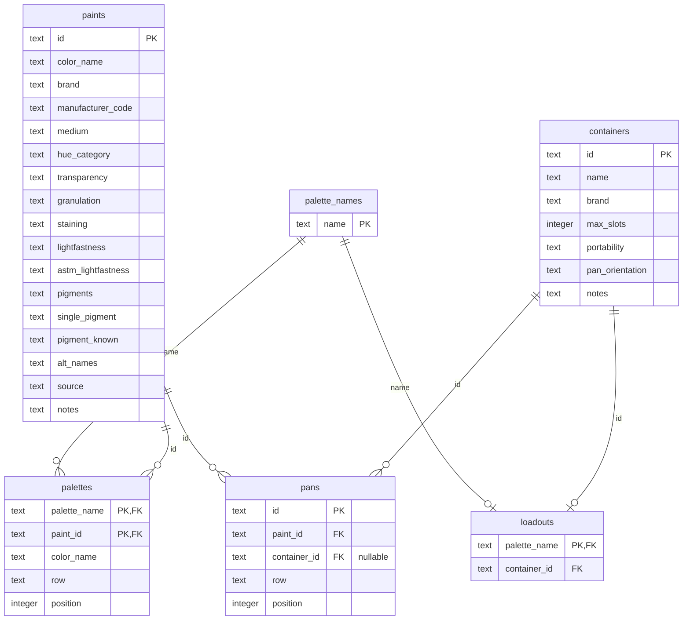

# Watercolor Palettes

A personal palette planning tool built around an inventory exported from [artistpigments.org](https://artistpigments.org).

## How it works

The project has three source files you maintain, two scripts that process them, a SQLite database, and two HTML outputs you use.

```
paints-inventory.xlsx      ← download fresh from artistpigments when you add paints
paints-manual-notes.csv    ← hand-maintained: hue categories, alt names, 3 uncatalogued CfM paints
pigment-index.csv          ← Handprint-derived pigment→color family reference

build_inventory.py         ← merges sources into data/paints.db (paints table)
build_html.py              ← generates index.html and labels.html from paints.db

data/paints.db             ← SQLite database (paints, palette_names, palettes, containers, loadouts, pans)

index.html                 ← open in browser: palette viewer + filterable inventory
labels.html                ← open in browser, print: pan-sized swatch labels
notes/                     ← markdown notes on each palette
```

## Database tables

`data/paints.db` contains six tables. The data is split between *plan* (what a palette should contain) and *physical reality* (what's actually in each box right now):

- **paints** — rebuilt from xlsx + manual notes on each run (72 paints)
- **palette_names** — list of valid palette names
- **palettes** — one row per paint per palette, with row/position for the *planned* layout
- **containers** — physical palette boxes (slot count, pan orientation)
- **loadouts** — which palette lives in which container
- **pans** — one row per physical half-pan, with `paint_id` and a nullable `container_id` (NULL = loose, not in any box)



The `paints` table is regenerated every time you run `build_inventory.py`. The other five tables are hand-curated in the database and preserved across runs.

## Updating after buying new paints

1. Add the new paint to your collection on [artistpigments.org](https://artistpigments.org)
2. Download a fresh export (xlsx) and replace `paints-inventory.xlsx`
3. Run `python3 build_inventory.py` — it will merge your manual notes and check foreign key integrity
4. Run `python3 build_html.py` to regenerate the HTML

If the new paint is a CfM color not on artistpigments, add it to `paints-manual-notes.csv` instead.

If the new paint has a pigment code not in `pigment-index.csv`, add it there (follow the existing format) so hue categories stay complete.

## Adding or editing a palette

Edit the database directly with `sqlite3 data/paints.db`:

```sql
-- Add a new palette name
INSERT INTO palette_names VALUES ('my-new-palette');

-- Add a paint to a palette
INSERT INTO palettes (palette_name, paint_id, color_name, row, position)
VALUES ('my-new-palette', 'g7gsr', 'Cadmium Yellow', 'row1', 1);
```

- `palette_name` must exist in `palette_names`
- `paint_id` must match an id in `paints`
- `row` values: `top/bottom` (for 2-row palettes) or `row1/row2/row3` (for 3-row palettes)
- `position` is the slot number within the row, left to right
- Slots are a maximum, not a target — leave gaps intentionally

After editing, run `python3 build_html.py` to regenerate.

## Managing pans

The `pans` table is the *physical reality* — each row is a half-pan you actually own. The `palettes` table is the plan; `pans` is what's currently sitting in your boxes. For loaded palettes, the HTML viewer renders pan placement (reality), not the plan.

Edit directly with `sqlite3 data/paints.db`:

```sql
-- Add a new loose pan
INSERT INTO pans (id, paint_id, container_id, row, position)
VALUES ('p047', 'g7gsr', NULL, NULL, NULL);

-- Place a pan in a container
UPDATE pans SET container_id = 'cfm_small', row = 'row2', position = 3
WHERE id = 'p047';

-- Move a pan out of a container (back to loose)
UPDATE pans SET container_id = NULL, row = NULL, position = NULL
WHERE id = 'p047';
```

Pan IDs are sequential strings (`p001`, `p002`, ...). Pick up from the current max.

## Adding palette notes

Create or edit a markdown file in `notes/` named `{palette-name}-palette.md` (e.g. `garden-palette.md`). It will be rendered below the palette in `index.html` automatically.

Other notes files (e.g. `brand-notes.md`) appear in a Notes section at the bottom of `index.html`.

## Printing swatch labels

Open `labels.html` in a browser and print. Cards are sized to standard half-pan dimensions (19mm × 30mm), oriented correctly per container:
- **Portrait** (19mm wide × 30mm tall): CfM Small, Szmal Metal
- **Landscape** (30mm wide × 19mm tall): CfM Yellow

Glue the printed label to the back of a hand-swatched cotton paper piece cut to the same size.

## Containers

| ID | Name | Brand | Slots | Orientation |
|---|---|---|---|---|
| cfm_yellow | Yellow | CfM | 12 | landscape |
| cfm_small | Small Palette | CfM | 14 | portrait |
| szmal_small | Szmal Metal | Roman Szmal | 12 | portrait |
| szmal_large | Szmal Large | Roman Szmal | 48 | portrait |

## Current palettes

| Palette | Container | Paints | Status |
|---|---|---|---|
| default | CfM Small | 14 | Active — plein air SF, urban sketching, loose botanicals |
| garden | Szmal Metal | 12 | Active — garden botanical paintings at home |
| urban-sketch | CfM Yellow | 8 | Active — urban sketching with black fountain pen |
| cfm-floral | CfM Yellow | 12 | Retired — reference only |

## Dependencies

```
pip3 install openpyxl markdown
```
